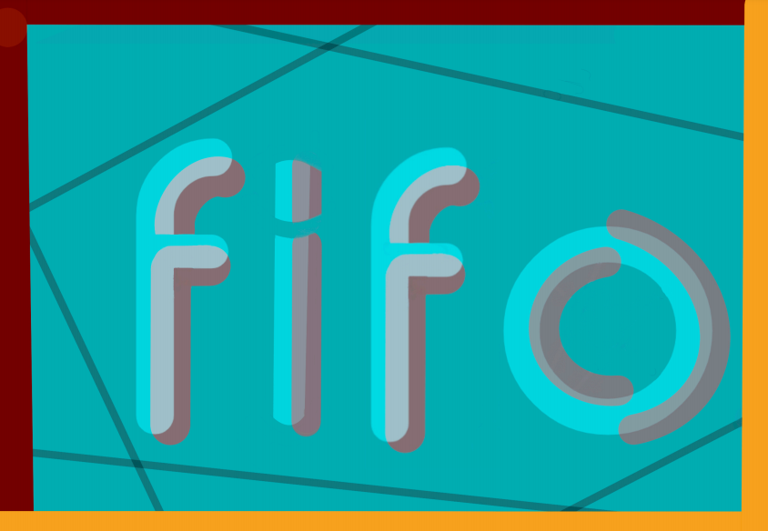

<p align="center">
  <a href="https://fifo.snaildos.com"></a>
</p>

<div align="center">
  <h1>Fifo Browser</h1>
  
[](https://github.com/snaildos/Fifo-Browser/actions/workflows/build.yml)
  
[](https://fifo.snaildos.com)

Fifo is a modern web browser, built on top of modern web technologies such as `Electron` and `React`, that can also be used as a framework to create a custom web browser (see the [License](#license) section). It's a more, optimized, more updated fork of Wexond. 

</div>

# Table of Contents:
- [Motivation](#motivation)
- [Features](#features)
- [Screenshots](#screenshots)
- [Downloads](#downloads)
- [Contributing](#contributing)
- [Development](#development)
  - [Running](#running)
- [Documentation](#documentation)
- [License](#license)

# Motivation

Building a custom browser would be way to hard, therefor, we forked Wexond as our base, we are theng going to extend from there.

# Features

- **Fifo Anti** - Browse the web without any ads and don't let websites to track you. Thanks to the 'Fifo Anti' powered by [Cliqz](https://github.com/cliqz-oss/adblocker), websites can load even 8 times faster!
- **Chromium without Google services and low resources usage** - Since Wexond uses Electron under the hood which is based on only several and the most important Chromium components, it's not bloated with redundant Google tracking services and others.
- **Fast and fluent UI** - The animations are really smooth and their timings are perfectly balanced.
- **Highly customizable new tab page** - Customize almost an every aspect of the new tab page!
- **Customizable browser UI** - Choose whether Fifo should have compact or normal UI.
- **Tab groups** - Easily group tabs, so it's hard to get lost.
- **Scrollable tabs**
- **Partial support for Chrome extensions** - Install some extensions directly from Chrome Web Store\* (see [#110](https://github.com/wexond/wexond/issues/110)) (WIP)

## Other basic features

- Downloads popup with currently downloaded items
- History manager
- Simple menu
- Perfect Incognito Mode!
- Bookmarks bar & manager
- Settings
- Find in page
- Dark and light theme
- Omnibox with autocomplete algorithm similar to Chromium
- State of the art tab system
- Security Security SECURITY!

## What can I expect to see in future updates?

- More security Features
- Auto complete

# Screenshots


UI normal variant:


UI compact variant:


# Downloads
- [Stable and beta versions](https://github.com/snaildos/Fifo-Browser/releases)

# [Roadmap](https://github.com/snaildos/Fifo-browser/projects)

# Contributing

If you have found any bugs or just want to see some new features in Fifo, feel free to open an issue. Every suggestion is very valuable for us, as they help us improve the browsing experience. Also, please don't hesitate to open a pull request. This is really important to us and for the further development of this project.

By opening a pull request, you agree to the conditions of the [Contributor License Agreement](cla.md).

# Development

## Running

Before running Fifo, please ensure you have **latest** [`Node.js`](https://nodejs.org/en/) and [`YARN`] installed on your machine. You can use NPM but it IS NOT recommended.

### Windows

Make sure you have build tools installed. You can install them by running this command as **administrator**:

```bash
$ npm i -g windows-build-tools
```

Yarn:
```bash
$ yarn install --save --legacy-peer-deps # Install needed depedencies. If you can, please, use yarn install.
$ yarn build # Rebuild native modules using Electron headers.
$ yarn dev # Run Fifo in development mode
```

NPM: Not recommended
```bash
$ npm install --save --legacy-peer-deps # Install needed depedencies. If you can, please, use yarn install.
$ npm run build # Rebuild native modules using Electron headers.
$ npm run dev # Run Fifo in development mode
```

### More commands

```bash
$ yarn compile-win32 # Package Fifo for Windows
$ yarn compile-linux # Package Fifo for Linux
$ yarn compile-darwin # Package Fifo for macOS
$ yarn lint # Runs linter
$ yarn lint-fix # Runs linter and automatically applies fixes
```

More commands can be found in [`package.json`](package.json).

# Documentation

Guides and the API reference are located in [`docs`](docs) directory.

# License

Fork of Wexond. It's up to the official developers.

[](https://app.fossa.com/projects/git%2Bgithub.com%2Fsnaildos%2FFifo-Browser?ref=badge_large)
